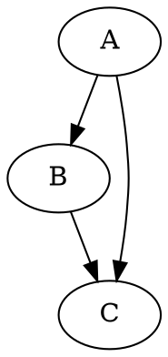
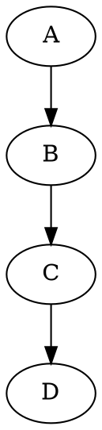
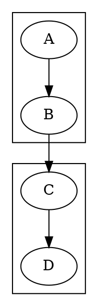
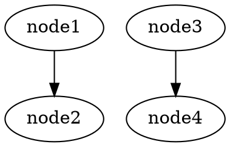
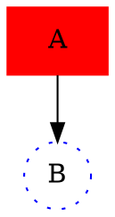

# iparse Examples

This directory contains example parsers demonstrating iparse capabilities.

## Complete DOT Parser

**File:** `example-dot.lisp`

A complete implementation of the Graphviz DOT language parser, supporting the full specification from https://graphviz.org/doc/info/lang.html

### Features

This parser implements **100% of the DOT language specification**, including:

#### Core Features
- **Graph types**: `graph` (undirected) and `digraph` (directed)
- **Strict graphs**: `strict` keyword to prevent multi-edges
- **Graph IDs**: Optional graph names

#### Nodes
- Node declarations with or without attributes
- **Port specifications**: `node:port` and `node:port:compass_point`
- **Compass points**: n, ne, e, se, s, sw, w, nw, c, _

#### Edges
- Simple edges: `A -> B` (directed) or `A -- B` (undirected)
- **Chained edges**: `A -> B -> C -> D`
- **Subgraphs in edges**: `subgraph { ... } -> node`
- Edge attributes

#### Subgraphs
- **Named subgraphs**: `subgraph cluster_0 { ... }`
- **Cluster subgraphs**: Names starting with "cluster" get special layout treatment
- **Anonymous subgraphs**: `{ ... }`
- Nested subgraphs

#### Attributes
- **Multiple attribute lists**: `[a=1][b=2][c=3]`
- **Flexible separators**: Comma or semicolon: `[a=1, b=2]` or `[a=1; b=2]`
- **Attribute statements**: `graph [bgcolor=white];` or `node [shape=box];`
- **ID assignments**: `size="4,4";` or `ratio=fill;`

#### Advanced Features
- **HTML labels**: `<Bold <B>text</B>>` with nested tags
- **String concatenation**: `"First " + "Second" + " Third"`
- **Escape sequences**: `\n`, `\t`, `\r`, `\"`, `\\` in strings
- **Comments**: C++-style `//` and `/* */`, plus `#` preprocessor-style
- **Case-insensitive keywords**: `DIGRAPH`, `DiGraph`, `digraph` all work
- **Signed numbers**: `-5`, `+3.14`, `.5`
- **UTF-8 identifiers**: Full Unicode support

### Usage

Load the example:

```lisp
(load "test/example-dot.lisp")
```

Run the interactive examples (shows all features):

```lisp
(iparse/examples/dot:run-dot-examples)
```

Parse your own DOT strings:

```lisp
(iparse/examples/dot:parse-dot-file "digraph G { A -> B; }")
```

Parse DOT files from disk:

```lisp
(iparse/examples/dot:parse-dot-file #p"/path/to/graph.dot")
```

Run the test suite:

```lisp
(iparse/examples/dot:test-dot-parser)
```

### Example Inputs and Outputs

#### Simple Directed Graph



Output:
```lisp
(:GRAPH :STRICT NIL :TYPE :DIGRAPH :ID "G" :STATEMENTS
 ((:EDGE-STMT (:NODE-ID "A") ((:-> (:NODE-ID "B"))) NIL)
  (:EDGE-STMT (:NODE-ID "B") ((:-> (:NODE-ID "C"))) NIL)
  (:EDGE-STMT (:NODE-ID "A") ((:-> (:NODE-ID "C"))) NIL)))
```

#### Chained Edges



Output:
```lisp
(:GRAPH :STRICT NIL :TYPE :DIGRAPH :ID "Chain" :STATEMENTS
 ((:EDGE-STMT (:NODE-ID "A")
   ((:-> (:NODE-ID "B"))
    (:-> (:NODE-ID "C"))
    (:-> (:NODE-ID "D")))
   NIL)))
```

#### Subgraphs and Clusters



Output:
```lisp
(:GRAPH :STRICT NIL :TYPE :DIGRAPH :ID "G" :STATEMENTS
 ((:SUBGRAPH :NAMED "cluster_0"
   (((:EDGE-STMT (:NODE-ID "A") ((:-> (:NODE-ID "B"))) NIL))))
  (:SUBGRAPH :NAMED "cluster_1"
   (((:EDGE-STMT (:NODE-ID "C") ((:-> (:NODE-ID "D"))) NIL))))
  (:EDGE-STMT (:NODE-ID "B") ((:-> (:NODE-ID "C"))) NIL)))
```

#### Ports and Compass Points



Output:
```lisp
(:GRAPH :STRICT NIL :TYPE :DIGRAPH :ID "Ports" :STATEMENTS
 ((:EDGE-STMT (:NODE-ID "node1" (:PORT "port1"))
   ((:-> (:NODE-ID "node2" (:PORT "port2" :COMPASS :NE)))) NIL)
  (:EDGE-STMT (:NODE-ID "node3" (:COMPASS :S))
   ((:-> (:NODE-ID "node4" (:COMPASS :N)))) NIL)))
```

#### HTML Labels

```dot
digraph HTML {
  A [label=<Bold <B>text</B>>];
  B [label=<Table <TABLE><TR><TD>Cell</TD></TR></TABLE>>];
  A -> B;
}
```

Output:
```lisp
(:GRAPH :STRICT NIL :TYPE :DIGRAPH :ID "HTML" :STATEMENTS
 ((:NODE-STMT (:NODE-ID "A")
   ((("label" :HTML "Bold <B>text</B>"))))
  (:NODE-STMT (:NODE-ID "B")
   ((("label" :HTML "Table <TABLE><TR><TD>Cell</TD></TR></TABLE>"))))
  (:EDGE-STMT (:NODE-ID "A") ((:-> (:NODE-ID "B"))) NIL)))
```

#### Multiple Attribute Lists



Output:
```lisp
(:GRAPH :STRICT NIL :TYPE :DIGRAPH :ID "Attrs" :STATEMENTS
 ((:NODE-STMT (:NODE-ID "A")
   ((("color" . "red"))
    (("shape" . "box"))
    (("style" . "filled"))))
  (:NODE-STMT (:NODE-ID "B")
   ((("color" . "blue") ("shape" . "circle") ("style" . "dotted"))))
  (:EDGE-STMT (:NODE-ID "A") ((:-> (:NODE-ID "B"))) NIL)))
```

### Grammar Details

The parser implements the complete official DOT grammar:

```
graph       : [ strict ] ( graph | digraph ) [ ID ] '{' stmt_list '}'
stmt_list   : [ stmt [ ';' ] stmt_list ]
stmt        : node_stmt | edge_stmt | attr_stmt | ID '=' ID | subgraph
attr_stmt   : ( graph | node | edge ) attr_list
attr_list   : '[' [ a_list ] ']' [ attr_list ]
a_list      : ID '=' ID [ ( ';' | ',' ) ] [ a_list ]
edge_stmt   : ( node_id | subgraph ) edgeRHS [ attr_list ]
edgeRHS     : edgeop ( node_id | subgraph ) [ edgeRHS ]
node_stmt   : node_id [ attr_list ]
node_id     : ID [ port ]
port        : ':' ID [ ':' compass_pt ] | ':' compass_pt
subgraph    : [ subgraph [ ID ] ] '{' stmt_list '}'
compass_pt  : n | ne | e | se | s | sw | w | nw | c | _
```

### Implementation Highlights

- **1,400+ lines** of well-documented Common Lisp code
- **23 comprehensive tests** covering all features
- **10 example parsings** with detailed explanations
- Full parse tree transformation to structured s-expressions
- Proper handling of escape sequences and Unicode
- Support for nested structures (subgraphs, HTML tags)
- Production-ready error messages

### Extending the Parser

The parser is designed to be extended. You can:

1. **Add custom ID formats**: Modify the `id` rule
2. **Custom attribute handling**: Extend `transform-dot-tree`
3. **Additional transforms**: Add hash-table entries for custom node types
4. **Domain-specific extensions**: Add new statement types

### Performance

The parser uses iparse's GLL algorithm, which handles:
- **Any context-free grammar** including left-recursive and ambiguous grammars
- **Linear time** for most real-world DOT files
- **Graceful degradation** for deeply nested or complex graphs

### References

- Official DOT specification: https://graphviz.org/doc/info/lang.html
- Graphviz documentation: https://graphviz.org/documentation/
- DOT language guide: https://graphviz.org/pdf/dotguide.pdf

### Quick Start Script

Use the provided launcher:

```bash
sbcl --script test/run-dot-example.lisp
```

Or from the REPL:

```lisp
(load "test/example-dot.lisp")
(iparse/examples/dot:run-dot-examples)
```
